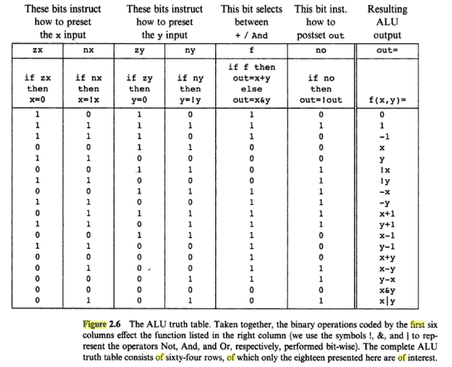

# LVM-16

A 16-bit CPU described using verilog(icarus verilog)

## Before you read further
* A word is 16-bits
* NOP is 16'b0100000000000000
* I suck at verilog

## Instructions

### 1) LOAD
Load a word from SRAM to a register
```
0 1 | X X | X X X X X X X X X X X X
      reg       address(12-bit)
```

NOTE: I suck at verilog(again). Run a NOP after a load to prevent overwriting the previously selected register. This isn't a bug in my hardware design, but an implementation bug.

### 2) WRITE
Write a word to SRAM from a register.
```
1 0 | X X X X X X X X X X X X | X X
          address(12-bit)       reg
```

### 3) OPERATION
Perform an operation(unary/binary) on register(s) and store the result in another register.
```
1 1 | X X | X X | X X | X X X X X X | X X
      dst   lhs   rhs    operation
```
The only part in my CPU which I did not design is the ALU, which I took from the book "The elements of computing systems". 


### 4) JUMP
Set the program counter to an address specified in a register if a value in a register satisfies a certain condition.
```
0 0 | X X | X X | X X | X X X X X X X X
      jmp   addr  val 
```
jmp table
* val < 0: 2'b10
* val > 0: 2'b11
* val = 0: 2'b00
* jst jmp: 2'b01

NOTE: val should never be 2'd0